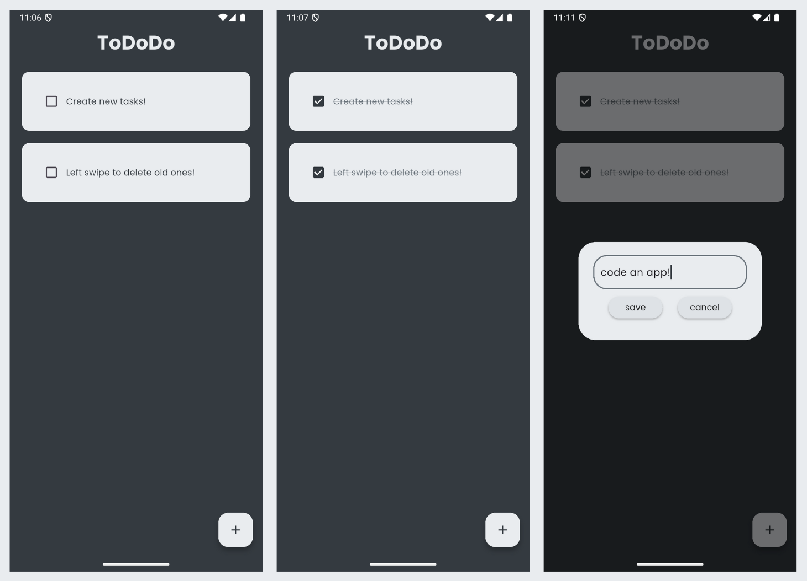

# To-Do!

This is a simple To-Do application built using Flutter. It allows users to add, mark as complete, and delete tasks with persistent local storage.

## Features

- Add new tasks
- Mark tasks as completed/incomplete
- Delete tasks
- Persistent storage using local database (Hive)

## Screenshots
 
> 

## File Overview

- `main.dart`: Entry point of the application.
- `home_page.dart`: Main UI where the list of tasks is displayed and managed.
- `todo_tile.dart`: Widget for displaying individual to-do items with a checkbox and delete icon.
- `dialog_box.dart`: Reusable widget for input dialog used to add new tasks.
- `my_button.dart`: Custom button widget used in dialog.
- `database.dart`: Contains logic for storing and retrieving tasks from local storage (Hive).

## Getting Started

### Prerequisites

- Flutter SDK installed
- Dart SDK
- Hive package dependency (add to `pubspec.yaml`):
  ```yaml
  dependencies:
    hive: ^2.0.0
    hive_flutter: ^1.1.0
    path_provider: ^2.0.0
  ```
### Running the App

1. Clone or download this repository.
2. Navigate to the project directory.
3. Run `flutter pub get` to fetch dependencies.
4. Use `flutter run` to start the application.

## License

This project is licensed under the [MIT License](LICENSE).
